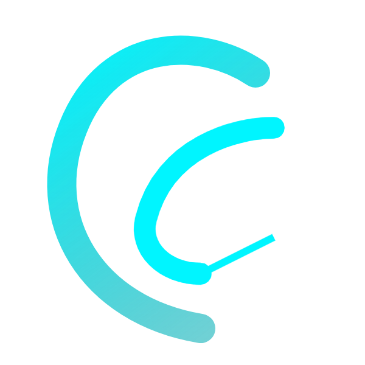

#  ClawLib

[English](#english) | [日本語](#japanese)

---

<a name="english"></a>
## English

**ClawLib** is a unified AI Agent Framework designed for the Claw ecosystem. It provides a robust, provider-agnostic core to build autonomous agents that can think, act, and communicate across multiple channels.

### ✨ Highlights

- **Control Plane Architecture**: Single-hub Gateway for low-latency communication.
- **Lane Queue System**: Serialized execution to prevent race conditions (The OpenClaw Way).
- **Multi-Provider Hub**: Toggle between Anthropic, OpenAI, Gemini, and Groq with one config line.
- **Skill SDK**: Build complex agent capabilities using strictly typed Zod schemas.
- **Local Sovereignty**: Your keys, your data, your infrastructure. No cloud middleman.

### 🚀 Quick Start

1. **Clone and Install**
   ```bash
   git clone https://github.com/ClawLib/ClawLib.git
   cd ClawLib
   npm install
   ```

2. **Configure environment**
   Create a `.env` file and add your API keys.

3. **Run the demo**
   ```bash
   npm run example
   ```

---

<a name="japanese"></a>
## 日本語

**ClawLib** は、Claw エコシステム向けに設計された統合 AI エージェントフレームワークです。プロバイダーに依存しない堅牢なコアを提供し、複数のチャネルで思考、行動、通信ができる自律型エージェントの構築を支援します。

### ✨ ハイライト

- **コントロールプレーン・アーキテクチャ**: 低遅延通信のためのシングルハブゲートウェイ。
- **レーンキューシステム**: 競合状態を防ぐためのシリアル実行（OpenClaw 方式）。
- **マルチプロバイダーハブ**: 設定 1 行で Anthropic、OpenAI、Gemini、Groq を切り替え可能。
- **スキル SDK**: 厳格に型定義された Zod スキーマを使用して、複雑なエージェント機能を構築。
- **ローカル主権**: あなたのキー、あなたのデータ、あなたのインフラ。クラウドの仲介者は不要です。

### 🚀 クイックスタート

1. **クローンとインストール**
   ```bash
   git clone https://github.com/ClawLib/ClawLib.git
   cd ClawLib
   npm install
   ```

2. **環境設定**
   `.env` ファイルを作成し、API キーを追加します。

3. **デモの実行**
   ```bash
   npm run example
   ```

---

## 📖 Documentation / ドキュメント

- [Architecture / アーキテクチャ](./docs/ARCHITECTURE.md)
- [Getting Started / はじめに](./docs/GETTING_STARTED.md)
- [Installation / インストール](./docs/INSTALLATION.md)
- [Kernel / カーネル](./docs/KERNEL.md)
- [Gateway / ゲートウェイ](./docs/GATEWAY.md)
- [Skills & Tools / スキルとツール](./docs/TOOLS.md)
- [Security / セキュリティ](./docs/SECURITY.md)
- [Roadmap / ロードマップ](./docs/ROADMAP.md)
